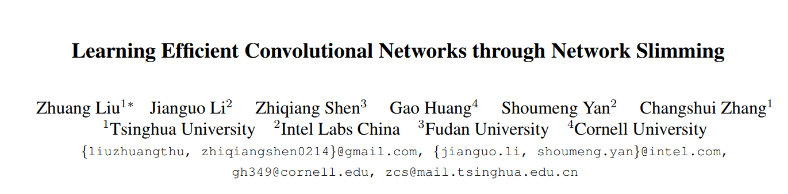
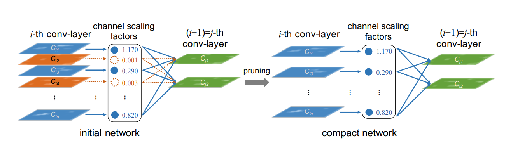

# Slimming-pytorch
This project implementation of the channel pruning through BN networks slimming in Pytorch.



# Code Structure
```
|---dataset
    |---dataset.py
|---models
    |---model.py
    |---new_resnet.py
    |---resnet_bn_slim.py
|---config.py
|---train.py
|---utils.py
|---real_prune.py
```

# Dataset

### Caltech-UCSD Birds(CUB-200-2011)

CUB-200-2011 is a bird classication task with 11,788 images from 200 wild bird species. The ratio of train data and test data is roughly 1 : 1. It is generally considered one of the most competitive datasets since each
species has only 30 images for training.

# Framworks



# Requirements

requires python3.6, pytorch 0.40 
```
pip install -r requirements.txt
```

# Usage
```
python train.py
```

# Reference

- [Learning Efficient Convolutional Networks through Network Slimming](https://arxiv.org/abs/1708.06519)

# TODO

- [ ] Fine tune.
  
